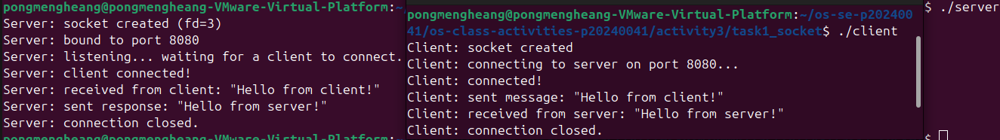
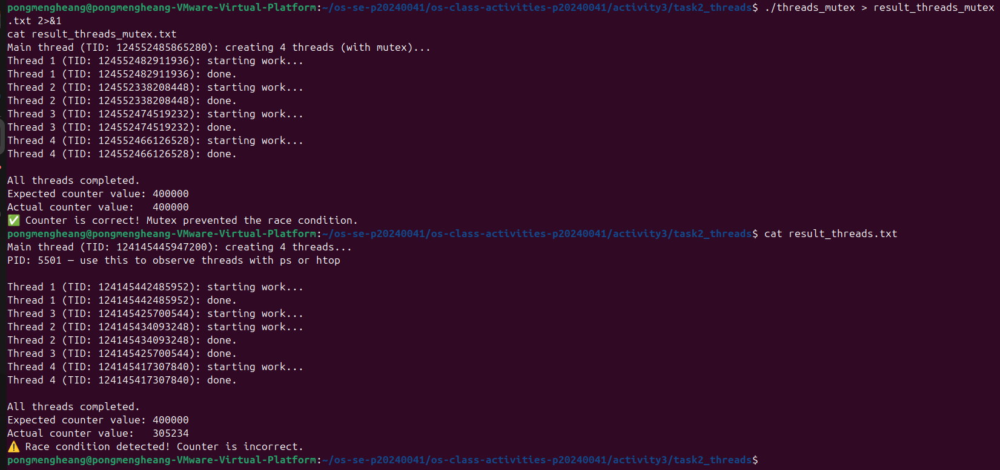
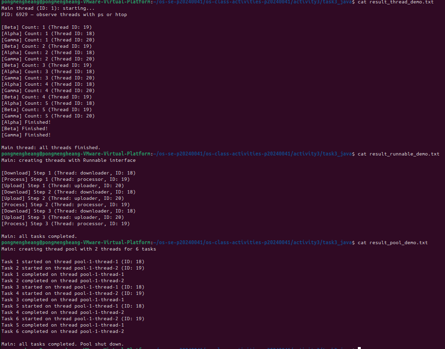
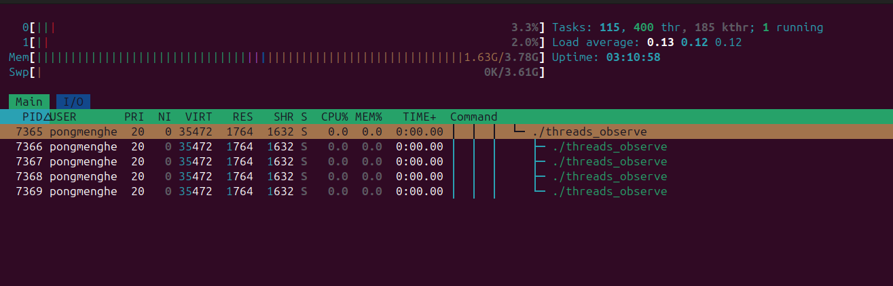
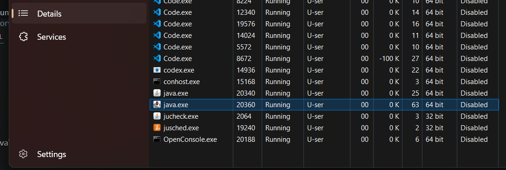

# Class Activity 3 — Socket Communication & Multithreading

- **Student Name:** Pong Mengheang
- **Student ID:** p20240041
- **Date:** 4/18/2026

---

## Task 1: TCP Socket Communication (C)

### Compilation & Execution

### Answers

1. **Role of `bind()` / Why client doesn't call it:**
   > bind() attaches the socket to a specific IP address and port number so clients know where to connect. The client doesn't call bind() because it doesn't need a fixed address — the OS automatically assigns it a random available port for outgoing connections.
   
2. **What `accept()` returns:**
   > accept() returns a new socket file descriptor specifically for communicating with that one connected client. The original server_fd keeps listening for new connections, while client_fd is used exclusively to send/receive data with the connected client.

3. **Starting client before server:**
   > You get connect: Connection refused because there is no process listening on port 8080. The TCP connection attempt is rejected immediately by the OS.

4. **What `htons()` does:**
   > htons() converts the port number from host byte order to network byte order (big-endian). Different CPU architectures store multi-byte integers differently. Network protocols always use big-endian, so conversion is required to ensure compatibility.

5. **Socket call sequence diagram:**
   > Server                          Client
------                          ------
socket()                        socket()
bind()
listen()
accept() ◄──── connect() ──────
read()   ◄──── send()   ──────
send()   ──── recv()    ──────►
close()                         close()

---

## Task 2: POSIX Threads (C)

### Output — With Mutex (Correct) and Without Mutex (Race Condition)

### Answers

1. **What is a race condition?**
   > A race condition happens when multiple threads access and modify the same shared variable simultaneously without synchronization. shared_counter++ is actually 3 operations: read, add 1, write back. When two threads do this at the same time, one thread's write can overwrite the other's, losing increments. The result is unpredictable and wrong.

2. **What does `pthread_mutex_lock()` do?**
   > It locks a mutex so only one thread can enter the protected section at a time. Other threads trying to lock the same mutex will block and wait until it's unlocked. This ensures shared_counter++ completes fully before another thread can touch it — eliminating the race condition.

3. **Removing `pthread_join()`:**
   > The main thread exits immediately after creating the worker threads, which terminates the entire process — killing all threads before they finish their work. You'll see partial output or no output at all. pthread_join() makes the main thread wait for each worker to fully complete.

4. **Thread vs Process:**
   > A thread is a lightweight unit of execution inside a process. Threads share the same memory space (code, heap, global variables, open files) but each has its own stack and registers. A process has its own separate memory space. Threads are faster to create and communicate easily through shared memory, but need synchronization to avoid race conditions.

---

## Task 3: Java Multithreading

### ThreadDemo & RunnableDemo & PoolDemo Outputs

### Answers

1. **Thread vs Runnable:**
   > extends Thread makes your class a thread itself — simple but you can't extend any other class (Java has single inheritance). implements Runnable separates the task from the thread — preferred because your class can still extend something else, and the same Runnable can be reused across multiple threads or passed to an ExecutorService.

2. **Pool size limiting concurrency:**
   > The pool was created with Executors.newFixedThreadPool(2) — only 2 worker threads exist. When all threads are busy, new tasks wait in a queue until a thread becomes free. This controls resource usage — you don't accidentally create hundreds of threads.

3. **thread.join() in Java:**
   > join() makes the calling thread (main) pause and wait until the specified thread finishes. Without it, main would print "all threads finished" immediately and possibly exit before Alpha, Beta, and Gamma complete their work.

4. **ExecutorService advantages:**
   > Creating a new thread for every task is expensive (memory, OS overhead). ExecutorService reuses a fixed pool of threads, manages the queue automatically, handles shutdown cleanly, and supports features like futures, timeouts, and scheduled tasks. It's safer and more efficient for real applications.

---

## Task 4: Observing Threads

### Linux — `ps -eLf` Output

PID    SPID TTY          TIME CMD
   7227    7227 pts/1    00:00:00 threads_observe
   7227    7228 pts/1    00:00:00 threads_observe
   7227    7229 pts/1    00:00:00 threads_observe
   7227    7230 pts/1    00:00:00 threads_observe
   7227    7231 pts/1    00:00:00 threads_observe

### Linux — htop Thread View

### Windows — Task Manager

### Answers

1. **LWP column meaning:**
   > LWP stands for Light Weight Process — it's the kernel-level thread ID. Each thread gets its own LWP ID even though they all share the same PID. The OS scheduler treats each LWP as an independent schedulable unit.

2. **/proc/PID/task/ count:**
   > You should find 5 entries — the main thread plus 4 worker threads. Each subdirectory is named after the thread's TID (thread ID) and contains per-thread information like status and CPU usage. This matches NUM_THREADS + 1 (the main thread).

3. **Extra Java threads:**
   > Java's JVM creates many internal threads automatically: garbage collector threads, JIT compiler threads, signal handling thread, finalizer thread, and more. So even a program with 3 user threads will show 10–15+ threads in Task Manager.

4. **Linux vs Windows thread viewing:**
   > Linux gives more detail — ps -eLf shows LWP IDs, CPU usage per thread, and /proc/<pid>/task/ exposes raw kernel data per thread. htop with Shift+H shows threads inline in the process tree. Windows Task Manager only shows a thread count, not individual thread details — you need jstack or Process Explorer for that level of detail.

---

## Reflection

> The most interesting part was seeing the race condition in action — the counter gave a different wrong answer every run, which clearly showed how unpredictable concurrent programs can be without synchronization. Understanding threads at the OS level through ps, /proc, and htop helped connect the code to what the kernel actually does. This knowledge is essential for writing correct concurrent programs because it shows that the OS can schedule threads in any order, so shared data must always be protected with mutexes or other synchronization mechanisms.
