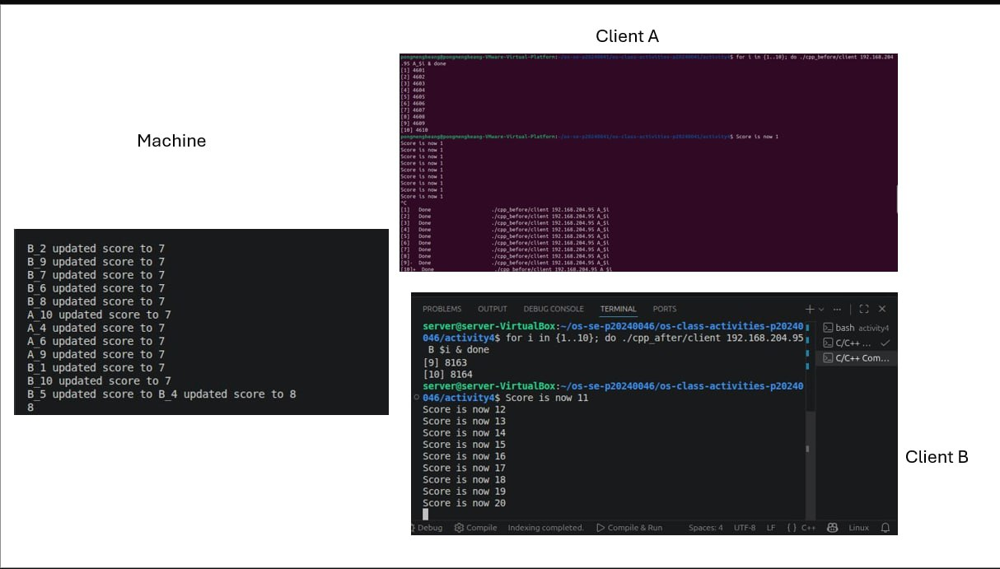
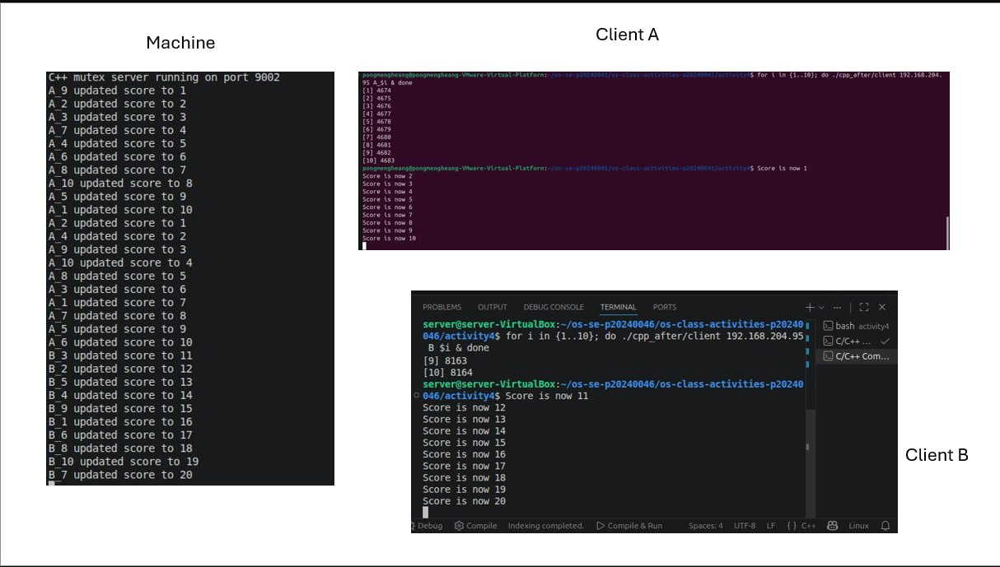
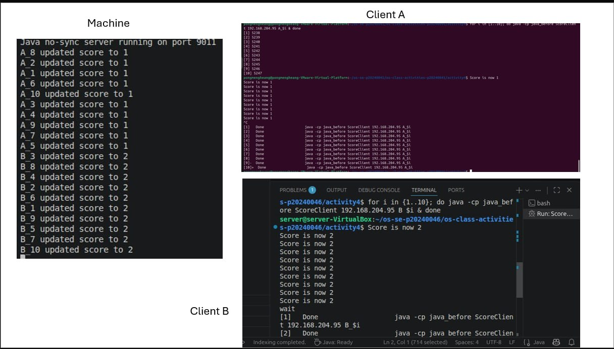
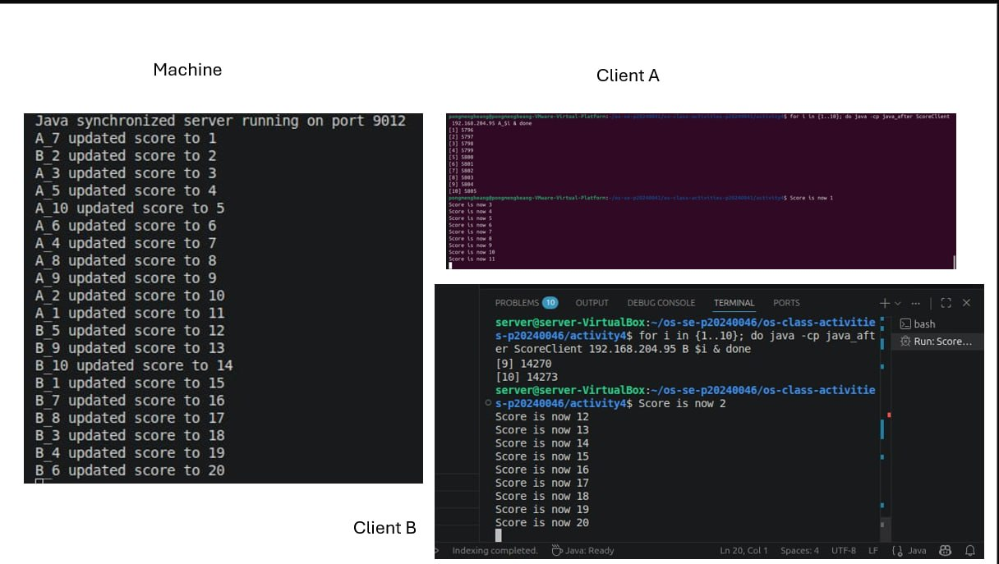

# Class Activity 4 — Shared File API

- **Student Name:** Pong Mengheang
- **Student ID:** p20240041
- **Partner Name:** Pi SereyVathanak
- **Partner Student ID:** p20240045
- **Partner Name:** Song Phengroth
- **Partner Student ID:** p20240046
- **Server Machine Owner:** Pi SereyVathanak
- **Server IP:** 192.168.204.95

---

## Task 1: C++ Before Mutex

- **Expected:** 20 | **Actual:** 8
- **What happened:** Race condition — clients read/wrote the file at the same time, overwriting each other's updates.

## Task 2: C++ After Mutex

- **Expected:** 20 | **Actual:** 20
- **What changed:** `std::lock_guard<std::mutex>` ensured only one client could update the file at a time.

## Task 3: Java Before Synchronized

- **Expected:** 20 | **Actual:** 2
- **What happened:** Same race condition as C++ before fix — concurrent threads overwrote each other's writes.

## Task 4: Java After Synchronized

- **Expected:** 20 | **Actual:** 20
- **What changed:** `synchronized` blocked other threads from entering the critical section during a read-modify-write.

---

## Questions

1. **Why use a server instead of direct file writes?** The server acts as a single gatekeeper, allowing locks to be applied. Direct client writes have no coordination mechanism.

2. **Why is there still a race condition before the fix?** The server handles multiple clients concurrently. Without locking, two threads can read the same value simultaneously and both write back the same incremented result.

3. **What does `std::lock_guard<std::mutex>` protect?** The read-modify-write block — only one thread can execute it at a time.

4. **What does `synchronized` protect?** The same critical section in Java — one thread at a time.

5. **Why is 20 expected?** 10 requests from A + 10 from B = 20 increments. With proper sync, none are lost.

6. **What if two servers write the same file?** Their internal locks are independent, so they can still overwrite each other — same race condition at the process level.

---

## Reflection

Both C++ (`std::mutex`) and Java (`synchronized`) solve the same problem — preventing concurrent threads from corrupting shared state. The main difference is style: C++ uses explicit RAII-based locking while Java uses a language-level keyword. The activity showed that even a simple file increment is unsafe without synchronization.
