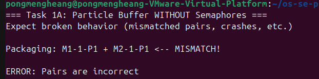
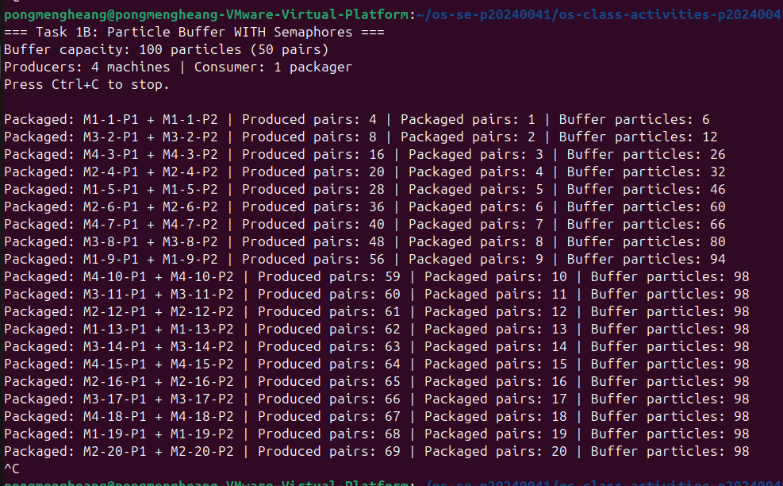
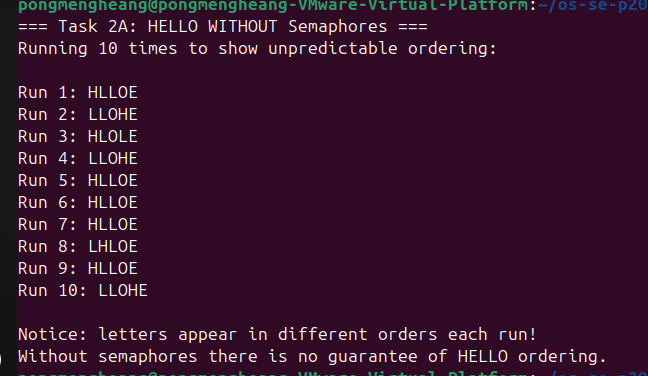
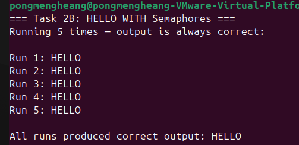

Class Activity 5 - Semaphores

Student Name: Pong Mengheang
Student ID: p20240041
Language: C++ 

Task 1A: Particle Buffer Before Semaphores

Error shown: Pairs are incorrect
Why: No mutex on the buffer. One producer pushes P1, another sneaks in before P2 is pushed, so the consumer picks up mismatched particles.

Task 1B: Particle Buffer After Semaphores

Producers: 4 | Buffer: 100 particles (50 pairs)
Semaphores: empty_pairs (init 50), full_pairs (init 0), mutex_sem (init 1)
Errors during normal run: None

Task 2A: HELLO Before Semaphores

Output: HLLOE (wrong order)
Why: Threads run in whatever order the OS schedules — no ordering is enforced.

Task 2B: HELLO After Semaphores

Threads: 3 (one per process)
Semaphores: start_h, after_e, after_l1, after_l2
Output: HELLO every time

Questions
1. Why does a producer wait before adding to the buffer?
To avoid overflow. It waits on empty_pairs so there is always room for both P1 and P2.
2. Why does the consumer wait before removing from the buffer?
To avoid underflow. It waits on full_pairs so a complete pair is always available before it tries to fetch.
3. Which semaphore protects the critical section?
mutex_sem — acquired by both producers and consumer before touching the buffer.
4. How does the program verify P1 and P2 belong to the same pair?
Each particle stores machine_id and pair_id. The consumer checks that both fields match on the two popped particles.
5. Why can letters print in the wrong order without semaphores?
All three threads start at the same time and the OS can schedule them in any order with nothing forcing one to wait for another.
6. Which semaphore forces H to print first?
start_h (init 1) — only Process 1 can acquire it, so it always prints H and E before releasing after_e to unblock Process 2.
7. What could cause deadlock?
Task 1: acquiring mutex_sem before the counting semaphore (reversed order creates circular wait). Task 2: any missing release() call leaves a thread blocked forever.

Reflection
Task 1 showed how unsynchronized buffer writes silently corrupt data. Task 2 showed how semaphores can enforce execution order between threads. Together they demonstrate the two main uses of semaphores: resource counting and ordering.
