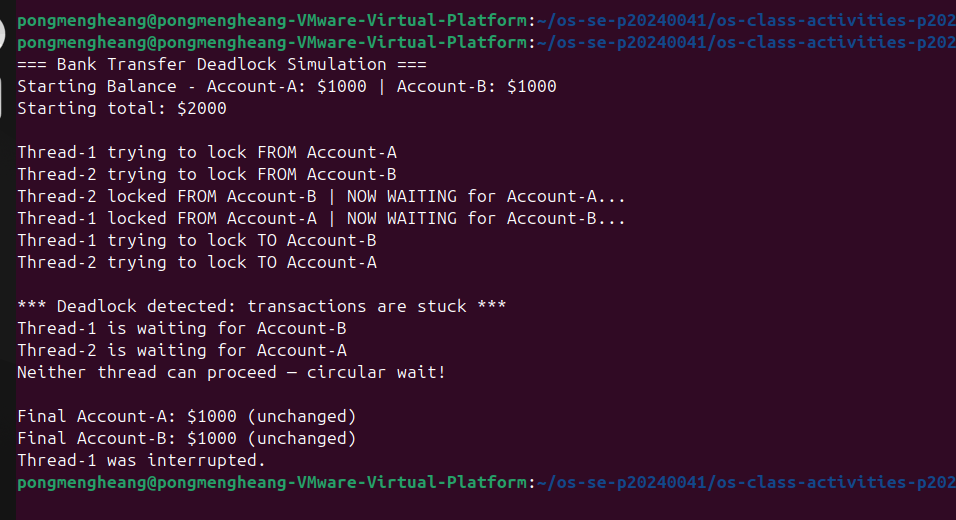
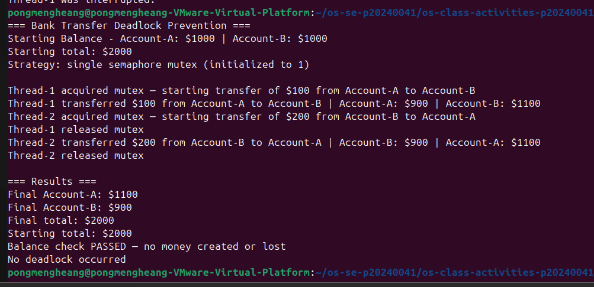

# Class Activity 6 - Deadlock Simulation

- **Student Name:** Pong Mengheang
- **Student ID:** p20240041
- **Language:** Java

---

## Task 1: Deadlock Version

- **Shared resources:** Account-A and Account-B
- **Transaction 1:** Transfer $100 from Account-A to Account-B
- **Transaction 2:** Transfer $200 from Account-B to Account-A
- **Deadlock message shown:** `Deadlock detected: transactions are stuck`
- **Why it got stuck:** Thread-1 locked Account-A and waited for Account-B. At the same time, Thread-2 locked Account-B and waited for Account-A. Neither could continue — circular wait.

---

## Task 2: Deadlock Prevention Version

- **Prevention strategy:** Single semaphore mutex (initialized to 1) wrapping the full transfer
- **Starting total:** $2000
- **Final total:** $2000
- **Both transfers completed:** Yes
- **Why no deadlock:** Only one thread can enter the transfer at a time, so circular wait is impossible.

---

## Questions

1. **Shared resources:** Account-A and Account-B.

2. **Hold-and-wait:** `from.lock.acquire()` holds Account-A while waiting on `to.lock.acquire()` for Account-B.

3. **Circular wait:** Thread-1 holds A and waits for B; Thread-2 holds B and waits for A — each is waiting on the other.

4. **Why watchdog is needed:** Without it, deadlocked threads hang silently forever. The watchdog detects no progress after 2 seconds and prints the deadlock message.

5. **How mutex prevents deadlock:** Only one thread can hold the mutex at a time, so no two threads can ever each hold one account and wait for another.

6. **Condition removed:** Hold-and-wait and circular wait are both eliminated — only one transfer runs at a time.

7. **Balance must stay the same:** Transfers move money between accounts; they don't create or destroy it. A changed total means a race condition caused data corruption.

---

## Reflection

This activity showed how easily deadlock appears when two threads each lock one resource and wait for another. The fix — a single mutex — is simple but effective. It taught me why databases and financial systems use strict locking strategies to prevent circular wait.
