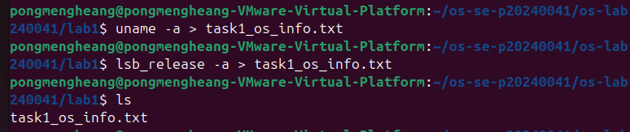
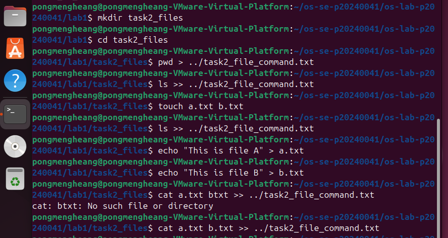
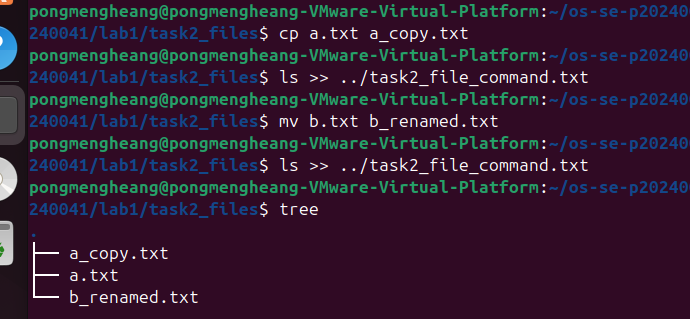
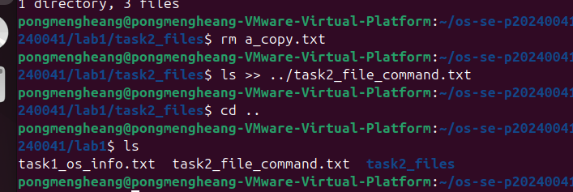
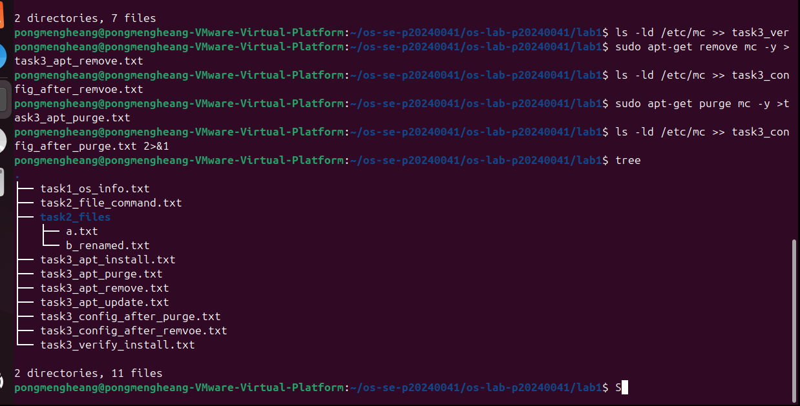
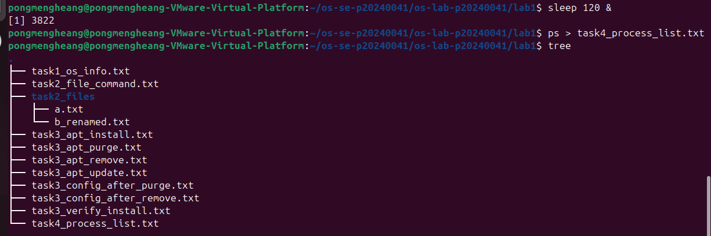
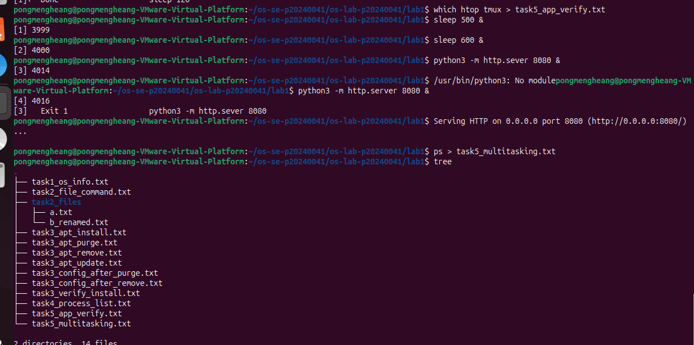
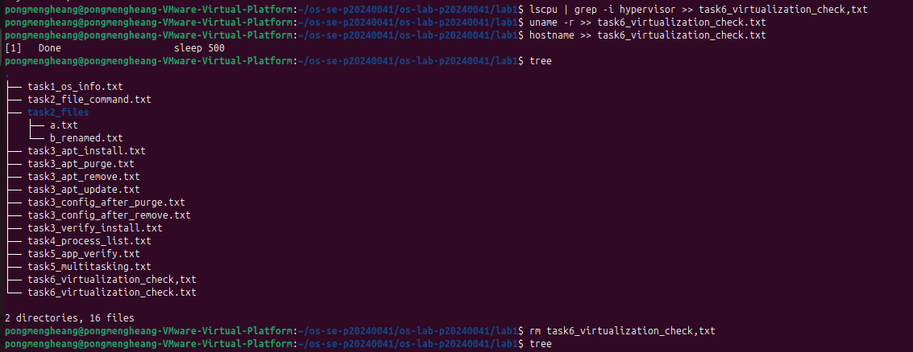

# OS-SE-p20240041

# OS-SE-p20240041

# OS Lab 1 Submission

- Student Name: Pong Mengheang
- Student ID: p20240041

## Task 1: Operating System Identification

I ran uname -a and lsb_release -a to identify the OS. The system is running Ubuntu 24.04.4 LTS with kernel version 6.17.0-14-generic on a x86_64 architecture.

<!-- Insert your screenshot for Task 1 below: -->

---

## Task 2: Essential Linux File and Directory Commands

I practiced creating directories with mkdir, creating files with touch, writing content with echo, copying with cp, renaming with mv, and deleting with rm. Each command was recorded into task2_file_commands.txt.

<!-- Insert your screenshot for Task 2 below: -->

---

## Task 3: Package Management Using APT

remove uninstalls the program but keeps its configuration files (the /etc/mc folder still existed after remove). purge removes everything including configuration files (the /etc/mc folder was completely gone after purge).

<!-- Insert your screenshot for Task 3 below: -->

---

## Task 4: Programs vs Processes (Single Process)

I ran sleep 120 & to start a background process, then used ps to confirm it appeared in the process list with its own PID, showing that a program becomes a process when executed.

<!-- Insert your screenshot for Task 4 below: -->

---

## Task 5: Installing Real Applications & Observing Multitasking

I installed htop and tmux, then started multiple background tasks including two sleep processes and a Python HTTP server on port 8080. The ps output showed all processes running simultaneously, demonstrating OS multitasking.

<!-- Insert your screenshot for Task 5 below: -->

---

## Task 6: Virtualization and Hypervisor Detection

Based on the output of systemd-detect-virt and lscpu, the system is running inside a virtual machine on VMware hypervisor, not on physical hardware.

<!-- Insert your screenshot for Task 6 below: -->

