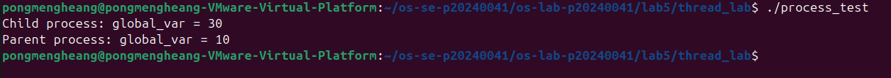
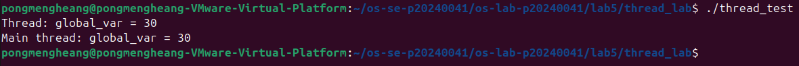
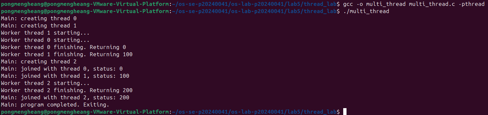
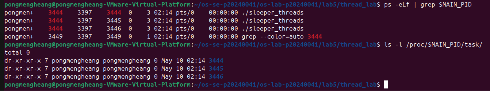
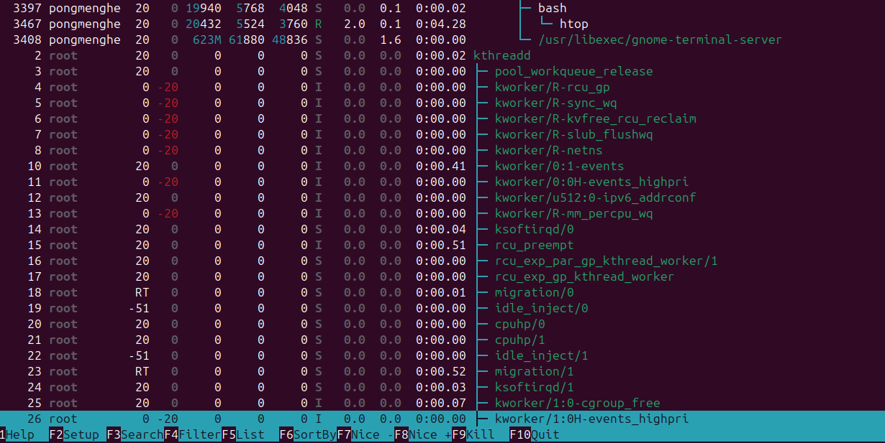
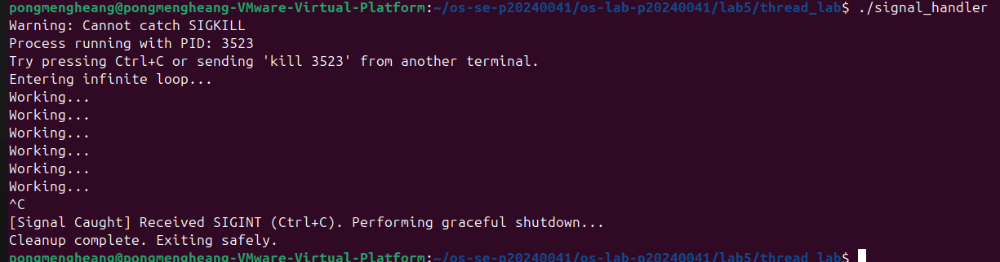
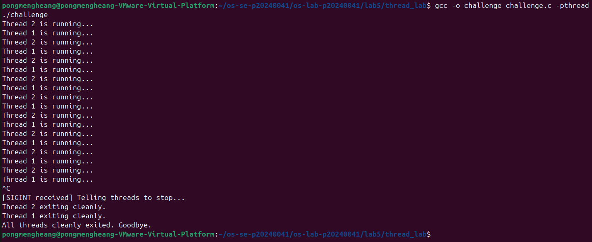

# OS Lab 5 Submission — Threads, Kernel Workers & Process Signals

- **Student Name:** Pong Mengheang
- **Student ID:** p20240041

---

## Task Output Source Files

Make sure all of the following files are present in your `lab5/thread_lab/` folder:

- [x] `process_test.c`
- [x] `thread_test.c`
- [x] `multi_thread.c`
- [x] `sleeper_threads.c`
- [x] `signal_handler.c`
- [x] `challenge.c`

---

## Screenshots

Insert your screenshots below.

### Screenshot 1 — Task 1: Process vs Thread (Process Test)

Show the output of `process_test.c`.

<!-- Insert your screenshot below: -->

---

### Screenshot 2 — Task 1: Process vs Thread (Thread Test)

Show the output of `thread_test.c`.

<!-- Insert your screenshot below: -->

---

### Screenshot 3 — Task 2: Thread Interaction

Show the output of `multi_thread.c`.

<!-- Insert your screenshot below: -->

---

### Screenshot 4 — Task 3: Visualizing 1:1 Thread Mapping

Show the `ps -eLf` output or `/proc/[pid]/task/` directory visualizing the LWP mapping for user threads.

<!-- Insert your screenshot below: -->

---

### Screenshot 5 — Task 3: `htop` Kernel Threads

Show `htop` visualizing kernel threads (usually bracketed names like `[kworker]`).

<!-- Insert your screenshot below: -->

---

### Screenshot 6 — Task 4: Catching `SIGINT`

Show the output of your `signal_handler` program gracefully catching `Ctrl+C`.

<!-- Insert your screenshot below: -->

---

### Screenshot 7 — Challenge: Graceful Multithreaded Shutdown

Show the output of your `challenge.c` program joining its threads and exiting gracefully after receiving `Ctrl+C`.

<!-- Insert your screenshot below: -->

---

## Answers to Lab Questions

1. **Why do threads share memory while processes do not (by default)?**

   > When you use `fork()`, the OS gives the child its own separate copy of memory, so changes in one process don't affect the other. Threads are different — they are created inside the same process, so they all share the same memory by default. This makes it easy for threads to communicate with each other directly.

2. **Based on the 1:1 mapping, what is the role of an LWP (Lightweight Process) in Linux?**

   > An LWP is the kernel's version of a thread. Every time you create a user thread with `pthread_create()`, Linux creates one matching LWP for it. The kernel schedules LWPs on the CPU, which means each thread can run on its own CPU core at the same time.

3. **Why is it restricted to send signals to kernel threads (e.g., `kthreadd` or `kworker`)?**

   > Kernel threads handle important system tasks like memory and I/O. If you could stop or kill them, it could crash or destabilize the whole system. The OS blocks signals to them to keep the system safe and stable.

4. **Why can't `SIGKILL` (kill -9) be caught by a signal handler?**

   > `SIGKILL` is handled directly by the kernel, not the program. The program never even sees it, so there is no way to catch or block it. This is intentional — it guarantees that any process can always be forcefully terminated no matter what.

---

## Reflection

> The most challenging part was Task 3, visualizing the 1:1 thread mapping using `ps`, `/proc/`, and `htop` together. The challenge task was also tricky because combining signal handling with threads required careful use of a shared `volatile` flag. These concepts matter in real applications — web servers use threads to handle many users at once, and databases use signal handling to shut down safely without losing data.
