# OS Lab 6 Submission — Linux Security, Users, Groups & File Permissions

- **Student Name:** Pong Mengheang
- **Student ID:** p20240041

---

## Task Output Files

Make sure all of the following files are present in your `lab6/` folder:

- [ ] `task1_users.txt`
- [ ] `task2_groups.txt`
- [ ] `task3_permissions.txt`
- [ ] `task3_stat_output.txt`
- [ ] `task4_special_bits.txt`
- [ ] `task5_acl.txt`
- [ ] `security_lab/whoami_suid.c`

---

## Screenshots

Insert your screenshots below.

### Screenshot 1 — Task 1: User Creation
Show `cat task1_users.txt` confirming both `dev_alice` and `dev_bob` accounts exist.
<!-- Insert your screenshot below: -->
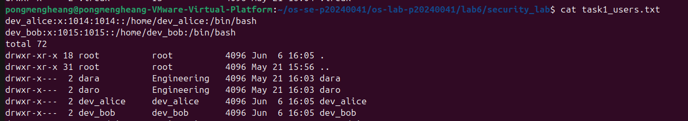

---

### Screenshot 2 — Task 1: User Modification
Show the updated `/etc/passwd` entry for `dev_alice` with the GECOS comment field.
<!-- Insert your screenshot below: -->
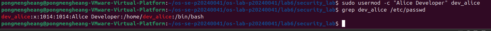

---

### Screenshot 3 — Task 2: Group Setup
Show `cat task2_groups.txt` with group membership for both users.
<!-- Insert your screenshot below: -->
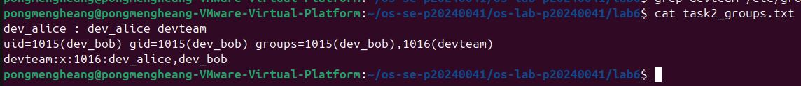

---

### Screenshot 4 — Task 2: Multiple Group Membership
Show `id dev_alice` confirming membership in both `devteam` and `auditors`.
<!-- Insert your screenshot below: -->
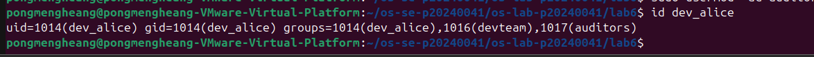

---

### Screenshot 5 — Task 3: Directory Permissions
Show `cat task3_permissions.txt` with `drwxrwx---` on the project directory.
<!-- Insert your screenshot below: -->
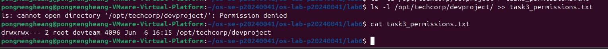

---

### Screenshot 6 — Task 3: Access Denied
Show the `Permission denied` error when `temp_user` tries to access the project directory.
<!-- Insert your screenshot below: -->
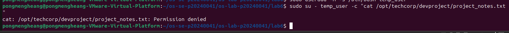

---

### Screenshot 7 — Task 4: setgid Bit
Show the directory listing with `s` in the group execute position, and `bob_file.txt` inheriting the `devteam` group.
<!-- Insert your screenshot below: -->
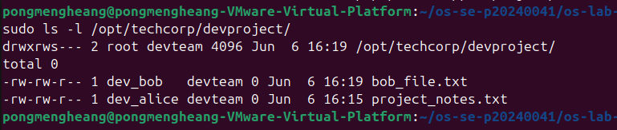

---

### Screenshot 8 — Task 4: Sticky Bit
Show the `t` bit in the directory listing and the `Operation not permitted` error when `dev_bob` tries to delete `dev_alice`'s file.
<!-- Insert your screenshot below: -->
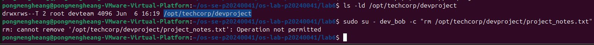

---

### Screenshot 9 — Task 4: setuid Bit
Show `ls -l whoami_suid` with `s` in the owner execute position and the program's UID output.
<!-- Insert your screenshot below: -->
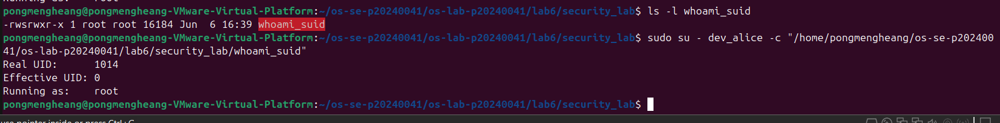

---

### Screenshot 10 — Task 5: ACL Directory
Show `getfacl /opt/techcorp/devproject` with the `auditors` ACE.
<!-- Insert your screenshot below: -->
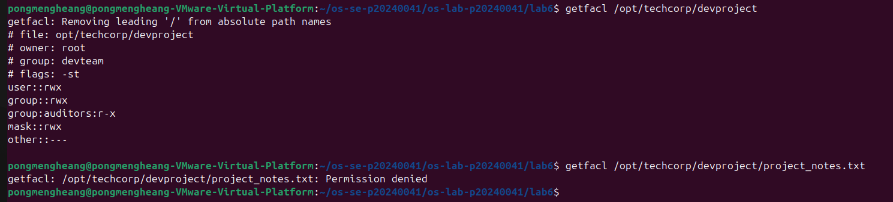

---

### Screenshot 11 — Task 5: ACL Access Test
Show `dev_alice` successfully accessing the file and `temp_user` being denied.
<!-- Insert your screenshot below: -->
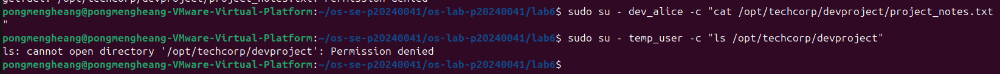

---

### Screenshot 12 — Task 5: ACL Output File
Show `cat task5_acl.txt` with the full ACL entries.
<!-- Insert your screenshot below: -->
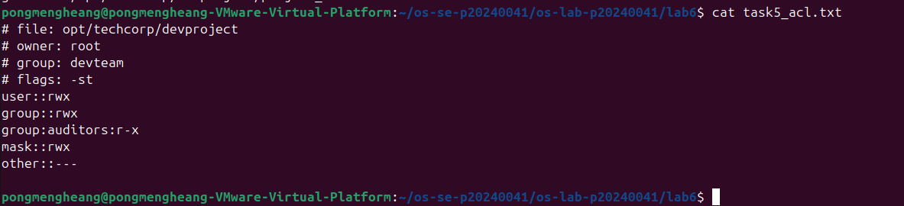

---

## Answers to Lab Questions

1. **What is the difference between `userdel` and `userdel -r`?**
   > userdel removes only the user account. userdel -r also deletes the user's home directory and mail spool.

2. **Why is it safer to use `visudo` instead of directly editing `/etc/sudoers`?**
   > visudo validates the syntax before saving. A syntax error in /etc/sudoers can lock all users out of sudo, so direct editing is risky.
3. **What happens when a `setgid` directory contains files created by different users? What benefit does this provide for team collaboration?**
   > New files automatically inherit the directory's group instead of the creator's primary group. This ensures all team members can access each other's files without manual chown.

4. **What limitation of standard Unix permissions does the ACL system solve?**
   > Standard Unix permissions only allow one owner and one group per file. ACLs allow fine-grained access for multiple specific users or groups without changing the file's primary ownership.
