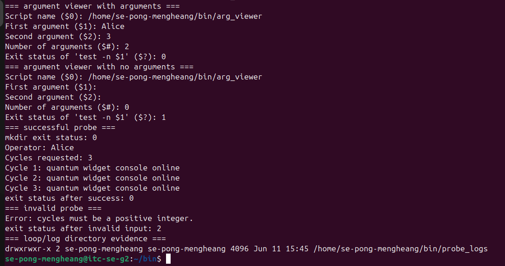
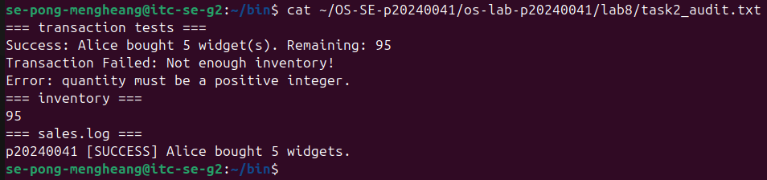
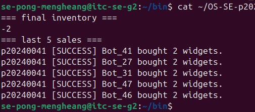
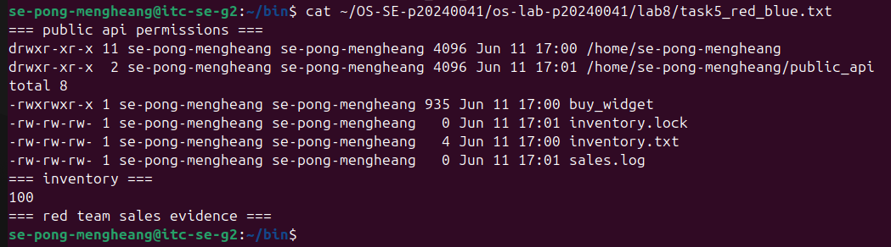
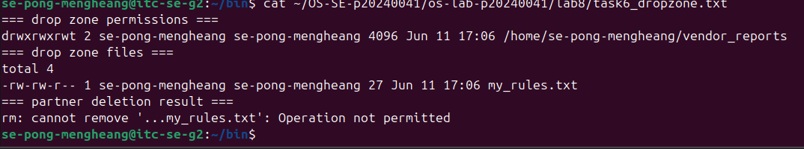
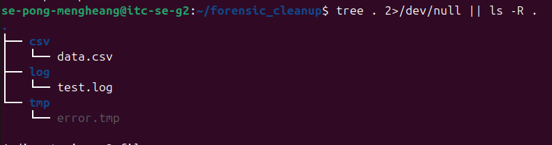

# OS Lab 8 Submission - The Quantum Widget Exploit
- **Student Name:** Pong Mengheang
- **Student ID:** p20240041
---
## Task Output Files
Make sure all of the following files are present in your `lab8/` folder:
- [x] `observations.txt`
- [x] `task0_warmup.txt`
- [x] `task1_validation.txt`
- [x] `task2_audit.txt`
- [x] `task4_mutex.txt`
- [x] `task5_red_blue.txt`
- [x] `task6_dropzone.txt`
- [x] `task7_cleanup.txt`
- [x] `scripts/arg_viewer`
- [x] `scripts/quantum_probe`
- [x] `scripts/buy_widget`
- [x] `scripts/bot_swarm`
- [x] `scripts/create_dropzone`
- [x] `scripts/cleanup`
---
## Screenshots
Insert your screenshots below.
### Screenshot 1 - Level 0: Bash Warm-Up Scripts
Show `arg_viewer` explaining `$0`, `$1`, `$2`, `$#`, and `$?`, then show `quantum_probe` using a condition and a loop.

---
### Screenshot 2 - Level 2: Audit Trails
Show input validation, a successful sale, failed transactions, final inventory, and `sales.log`.

---
### Screenshot 3 - Level 4: Mutex Patch
Show `inventory.txt` exactly `0` after the patched `bot_swarm`, plus the last five lines of `sales.log`.

---
### Screenshot 4 - Level 5: Red Team vs. Blue Team
Show `public_api` permissions, inventory, and sales log evidence that your classmate executed your API.

---
### Screenshot 5 - Level 6: Secure Drop Zone
Show the sticky bit in `ls -ld` output and evidence that your partner could not delete your file.

---
### Screenshot 6 - Level 7: Forensic Cleanup
Show `tree` or `ls -R` output proving `.log`, `.csv`, and `.tmp` files were sorted into folders.

---
## Race Condition Observations
Summarize your five vulnerable `bot_swarm` runs from `observations.txt`:
| Run | Final Inventory | Notes |
|:---:|----------------:|-------|
| 1 | -2 | Unexpected — inventory went negative |
| 2 | -2 | Same result, race condition consistent |
| 3 | -2 | Processes read same value before any write |
| 4 | -2 | Deductions lost due to concurrent access |
| 5 | -2 | Confirms unprotected critical section |
---
## Answers to Lab Questions

1. **In `arg_viewer`, what did `$0`, `$1`, `$2`, `$#`, and `$?` mean when you ran `arg_viewer Alice 3`?**

   > `$0` was the name of the script itself (`arg_viewer`). `$1` was the first argument (`Alice`) and `$2` was the second (`3`). `$#` was the total number of arguments passed, which was `2`. `$?` was the exit status of the most recent command — in this case `test -n "$1"`, which succeeded because `$1` was not empty, so it returned `0`.

2. **What does TOC-TOU mean, and where did it appear in the vulnerable `buy_widget` script?**

   > TOC-TOU stands for Time-of-Check to Time-of-Use. It describes a race condition where the state of a resource changes between the moment you check it and the moment you act on it. In the vulnerable `buy_widget`, the script read the inventory value from `inventory.txt`, checked whether enough stock was available, then wrote the new value back. Because these three steps were not atomic, two processes could both read the same inventory value at the same time, both pass the check, and both subtract from the same number — causing lost deductions and a corrupted final count.

3. **Why did `bot_swarm` sometimes leave inventory values other than `0` before the patch?**

   > The OS scheduler runs background processes in an unpredictable order. Without a lock, multiple `buy_widget` processes could read the inventory simultaneously, each seeing the same current value. They would each calculate a new value independently and write it back, with the last write winning and overwriting all the others. This caused some deductions to be silently discarded, leaving inventory higher than expected — or in our case, negative when processes raced past the zero boundary.

4. **What part of the script is the critical section, and why must it be protected?**

   > The critical section is the block that reads `inventory.txt`, checks whether enough stock exists, calculates the new total, writes it back, and appends to `sales.log`. It must be protected because all four steps depend on each other — if any other process modifies the inventory file between the read and the write, the calculation becomes invalid and the data is corrupted.

5. **How does `flock -x` enforce mutual exclusion between concurrent processes?**

   > `flock -x` acquires an exclusive lock on a file descriptor before entering the critical section. If a second process tries to acquire the same lock while the first process holds it, the OS blocks the second process until the first releases it by exiting the subshell. This serialises access to the shared inventory file so only one process can read and write at a time, eliminating the race condition.

6. **Which permissions did you use to let a classmate run your API without giving full access to your home directory?**

   > `chmod o+x "$HOME"` gave others traversal permission on the home directory without letting them list its contents. `chmod 755 ~/public_api` made the API folder readable and enterable by everyone. `chmod o+rx ~/public_api/buy_widget` let others read and execute the script. `chmod o+rw` on `inventory.txt`, `sales.log`, and `inventory.lock` let the script read and write the shared files on behalf of any user running it.

7. **Why does the sticky bit protect files in a shared drop zone?**

   > Normally, write permission on a directory lets any user delete any file inside it, regardless of who owns the file. The sticky bit changes this behaviour: even if a directory is world-writable, only the file's owner (or root) can delete it. This means a partner can create their own files in the drop zone but cannot remove files that belong to someone else.

8. **What defensive scripting practice from this lab would you use in a real production script?**

   > The most important practice is wrapping all reads and writes to shared state inside an `flock` critical section. In production, any script that updates a shared file — a counter, a log, a queue — risks data corruption if two instances run at the same time. Using `flock` costs almost nothing in performance and prevents an entire class of subtle bugs that are very hard to reproduce and diagnose after the fact.

---
## Reflection

This lab made the relationship between Bash, the OS scheduler, file permissions, and concurrent access concrete in a way that is hard to get from a lecture alone. Writing a script that works perfectly for one user, then watching it corrupt shared state the moment fifty processes hit it simultaneously, shows exactly why the OS scheduler cannot be relied on to keep shared resources safe. The `flock` patch demonstrated that protecting a critical section is not complicated — a few lines of shell code are enough — but you have to know where the critical section is and why it matters. The permissions work in Level 5 and Level 6 reinforced the principle of least privilege: every permission you grant beyond what is strictly necessary is an attack surface, and the sticky bit is a good example of the OS providing a precise, narrow control rather than forcing a choice between full access and no access.
